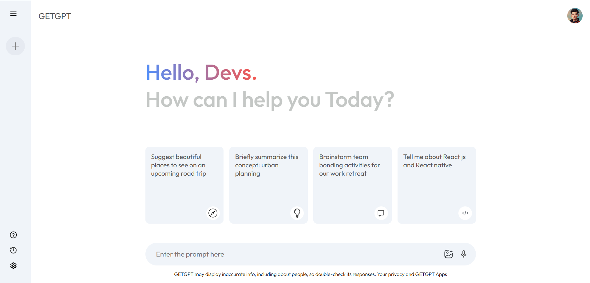

# GETGPT is a text-based AI chatbot built as a clone of Gemini and ChatGPT.
It is designed purely for textual interactions, enabling users to explore conversational AI without additional features like images or speech.

# ✨Key Features:

Text-only chatbot interface

Human-like conversational abilities

Context-aware and intelligent responses

Simple and lightweight design for developers

🚀 GETGPT is perfect for experimenting with AI-driven text conversations and building custom chat solutions.

